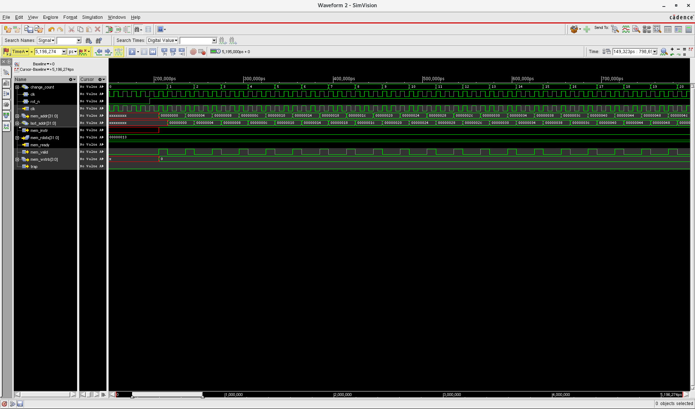
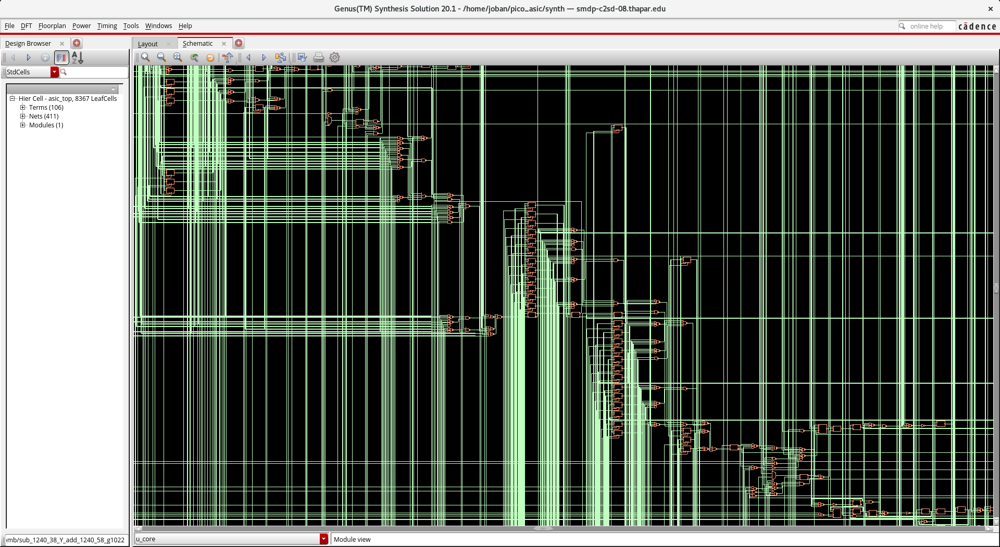
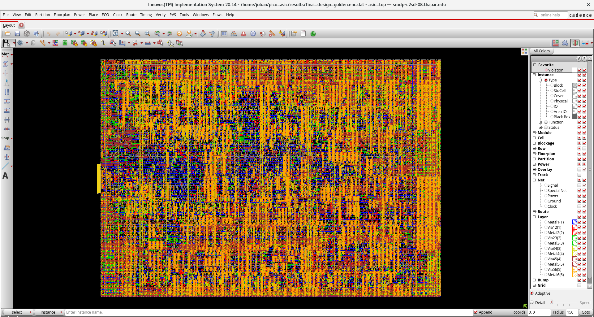
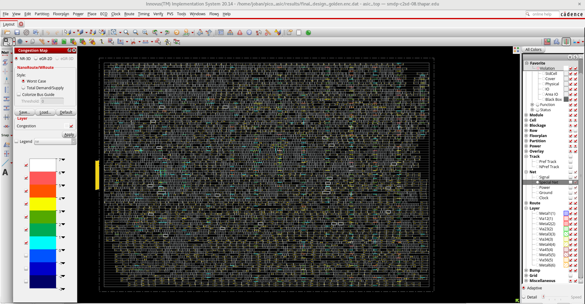
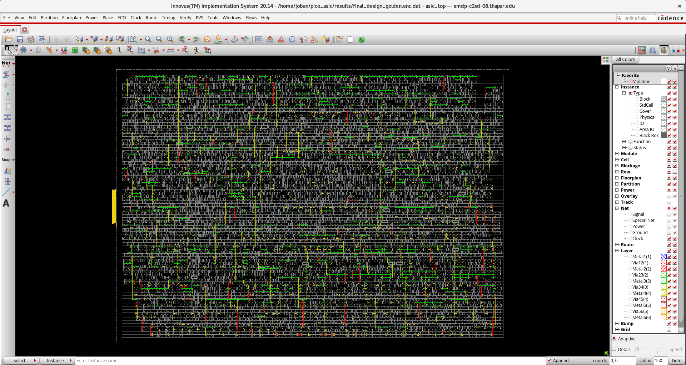
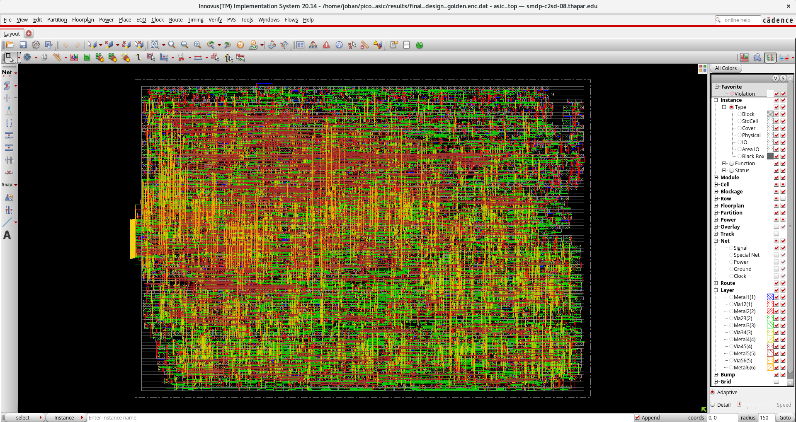
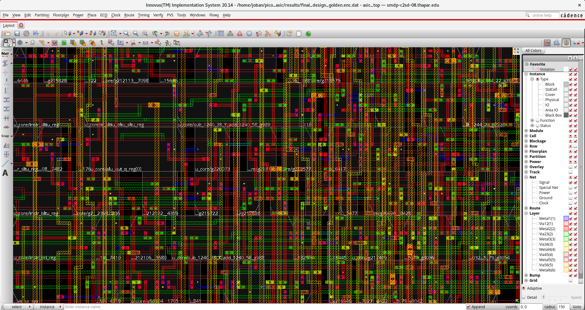
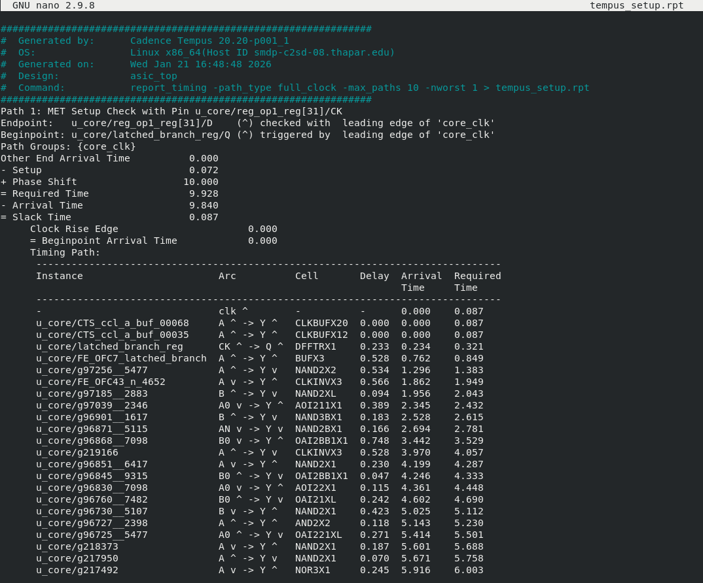
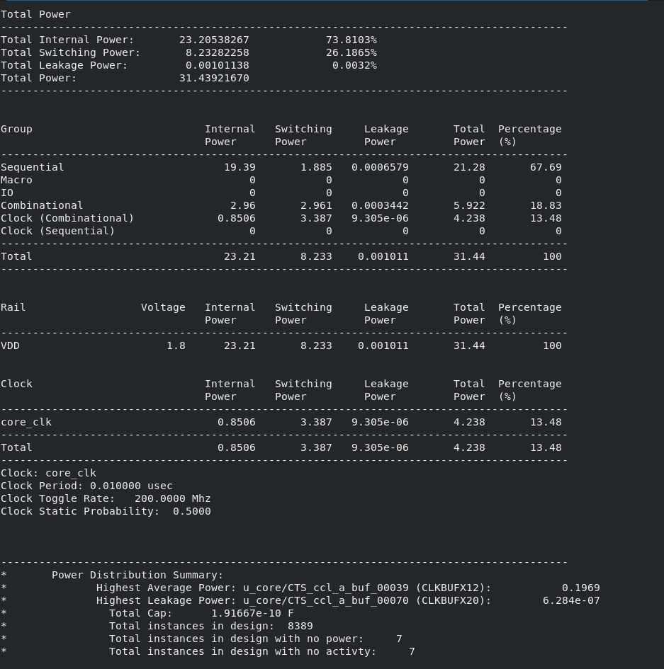

# RTL-to-GDSII Implementation: PicoRV32 RISC-V Core (180nm)


## Project Overview
This project implements a complete **RTL-to-GDSII Physical Design flow** for the **PicoRV32**, a size-optimized RISC-V CPU core. The design was realized using the **Cadence Digital Flow** (Xcelium, Genus, Innovus, Tempus) at the **180nm technology node**.

The primary goal was to take the synthesized netlist through the Place & Route (PnR) flow and produce a **tapeout-ready database** with closed timing and zero DRC/LVS violations at **100 MHz**.

### Key Metrics
| Metric | Value | Status |
| :--- | :--- | :--- |
| **Technology** | SCL 180nm | Verified |
| **Frequency** | **100 MHz** | Met (Positive Slack) |
| **Gate Count** | ~8,400 Cells | Optimized |
| **Total Power** | **31.44 mW** | Static + Dynamic |
| **Utilization** | ~70% | High Density |
| **DRC/LVS** | 0 Violations | Clean |

---

## Design Flow Stages

### 1. Functional Verification (Xcelium)
Before starting physical implementation, I verified the RTL to ensure the core correctly executes RISC-V instructions.
* **Process:** Compiled the Verilog source and testbench using Cadence Xcelium.
* **Result:** Confirmed correct instruction fetch, decode, and execute behavior via waveform analysis.


*Fig 1: Xcelium waveforms showing successful instruction execution.*

### 2. Logic Synthesis (Genus)
Mapped the generic Verilog RTL to the 180nm standard cell library.
* **Process:** Translated the RTL into a gate-level netlist optimized for area and timing.
* **Constraints:** Applied standard timing constraints (SDC) with a target clock period of 10ns (100 MHz).
* **Outcome:** Generated a clean, mapped netlist ready for physical design.


*Fig 2: Gate-level schematic showing standard cell mapping.*

### 3. Floorplanning & Power Planning (Innovus)
This stage defined the physical dimensions of the chip and the power distribution network.
* **Core Setup:** Defined a square core area with appropriate margins for I/O and utilization.
* **Power Mesh:** Implemented a standard **M3/M4 Power Mesh (VDD/VSS)** using rings and stripes to ensure robust power delivery.


*Fig 3: M3/M4 Power Mesh structure.*

### 4. Placement (Innovus)
Standard cells were placed into the core rows using timing-driven and congestion-aware algorithms.
* **Execution:** Used standard placement commands (`place_opt_design`) to position cells while minimizing wire length and avoiding local congestion.
* **Outcome:** Achieved a valid placement with no cell overlaps and uniform density.


*Fig 4: Heat map showing placement congestion (Blue indicates low congestion).*

### 5. Clock Tree Synthesis (CTS)
Built the clock distribution network to deliver the clock signal across the chip.
* **Implementation:** Ran the CCOpt (Clock Concurrent Optimization) engine to build a buffered clock tree that balances skew and meets setup/hold requirements.


*Fig 5: Visualization of the clock tree.*

### 6. Routing & Signoff
* **Routing:** Completed detailed signal routing using Metal 1 through Metal 6 layers.
* **Physical Verification:** Performed Geometry (DRC) and Connectivity (LVS) checks to confirm the design meets all foundry manufacturing rules.

| Detailed Routing | Chip Zoom |
| :---: | :---: |
|  |  |
| *Full Signal Routing* | *Detail View of Standard Cells* |

---

## Final Analysis Results

### Timing Closure (Tempus)
Static Timing Analysis (STA) confirmed the design operates correctly at the target frequency of 100 MHz.
* **Setup Analysis:** Met requirements with positive slack.
* **Hold Analysis:** Met requirements; hold violations were resolved during the routing optimization stage.


*Fig 6: Final Setup Timing Report showing positive slack.*

### Power Analysis
Total power consumption was analyzed at the Typical corner (1.8V, 25°C).
* **Dynamic Power:** ~8.2 mW
* **Internal Power:** ~23.2 mW
* **Leakage Power:** <1 mW



*Fig 7: Detailed Power Breakdown.*

---

## Repository Structure
```text
rtl-to-gdsii-picorv32/
├── rtl/                # Verilog Source Code (Core & Wrapper)
├── cons/               # SDC Timing Constraints
├── scripts/            # Tool Scripts (Genus, Innovus, Tempus)
├── pnr/                # Place & Route Logs and Reports
├── results/            # Final GDSII, Netlists, and Spef
│   └── Screenshots/    # Engineering plots and waveforms
└── README.md           # Project Documentation
